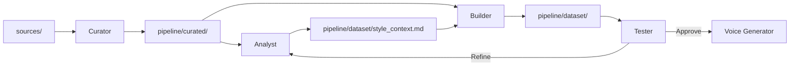

# Agents — VoxMea

> AI agent definitions within the writing style cloning pipeline.

---

## Agent 1: Curator

**Script:** `pipeline/scripts/curate.py`

**Role:** Filter, clean, and select texts that authentically represent the author's style.

**Responsibilities:**
- Scan `sources/` for valid files (`.md`, `.txt`, `.eml`, `.html`, `.docx`, `.pdf`)
- Remove YAML frontmatter, code blocks, and content irrelevant to style
- Redact sensitive data (emails, phones, addresses, financial info) via configurable regex
- Classify texts by type: narrative, argumentative, informal, technical
- Output clean files to `pipeline/curated/`

---

## Agent 2: Analyst

**Script:** `pipeline/scripts/analyze_style.py`

**Role:** Examine the curated corpus and extract a detailed linguistic profile.

**Responsibilities:**
- Analyze vocabulary patterns, word frequency, n-grams
- Measure sentence structure (average length, std dev, rhythm)
- Map punctuation fingerprint (em-dashes, ellipses, etc.)
- Detect filler words and recurring connectors
- Classify tone (formal/informal, serious/humorous)
- Generate `pipeline/dataset/style_context.md`

**Analysis Dimensions:**
```
Vocabulary    → Register, jargon, colloquialisms
Syntax        → Sentence length, complexity, rhythm
Tone          → Formal/informal, serious/ironic, direct/subtle
Structure     → Paragraphs, transitions, use of lists
Markers       → Filler words, favorite connectors, punctuation
Personality   → Humor, cultural references, analogies
```

---

## Agent 3: Builder

**Script:** `pipeline/scripts/build_dataset.py`

**Role:** Consolidate curated texts into LLM-ready formats.

**Responsibilities:**
- Unify texts into `pipeline/dataset/unified_corpus.txt` with document separators
- Generate prompt/completion pairs in JSONL format for fine-tuning
- Smart chunking respecting paragraph boundaries
- Token counting via tiktoken

---

## Agent 4: Tester

**Script:** `pipeline/scripts/test_generation.py`

**Role:** Validate that LLM generations faithfully replicate the author's style.

**Responsibilities:**
- Execute test prompts against configured LLM (Ollama, LM Studio, llama.cpp)
- Compare generations against control text
- Evaluate: lexical similarity, sentence length, punctuation, readability
- Save timestamped reports to `pipeline/tests/results/`

---

## Agent 5: Voice Generator

**Script:** `pipeline/scripts/voice_mode.py`

**Role:** Generate original text in the author's voice.

**Features:**
- CLI mode: `--topic "..." --chars 35000`
- Interactive fallback
- Iterative generation for long outputs (splits into parts)
- Comma-formatted numbers supported (`35,000`)
- Output saved to `pipeline/output/` as timestamped `.md` files
- Session logged to `logs/`

---

## Agent Workflow



---

## Notes

- All agents are run automatically via `start.py`
- The flow is iterative: Tester results feed back to Analyst and Builder
- Each agent logs activity for traceability
