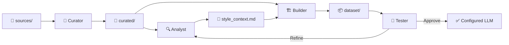

# 🤖 Agents — VoxMea

> Definition of AI agents and their roles within the writing style cloning pipeline.

---

## Agent 1: Curator

**Role:** Filter, clean, and select texts that authentically represent the author's style.

**Responsibilities:**
- Scan the `sources/` folder for valid files (`.md`, `.txt`, `.eml`).
- Remove code blocks, logs, raw data tables, and content irrelevant to style.
- Redact sensitive information (proper names, addresses, financial data).
- Classify texts by type: narrative, argumentative, informal, technical-personal.
- Output results to `curated/`.

**Filtering Criteria:**
| Include ✅ | Exclude ❌ |
|---|---|
| Personal reflections | Source code |
| Opinion articles | System logs |
| Emails with personal tone | Raw tabular data |
| Notes with unique voice | Third-party copy-paste |
| Creative drafts | Unpersonalized templates |

---

## Agent 2: Analyst

**Role:** Examine the curated corpus to extract a detailed linguistic profile of the author.

**Responsibilities:**
- Analyze vocabulary patterns, filler words, and recurring expressions.
- Identify predominant syntactic structure (long vs. short sentences, subordinate clauses).
- Map predominant emotional tone by text category.
- Detect frequent rhetorical devices (metaphors, irony, rhetorical questions).
- Generate `style_context.md` with the resulting style profile.

**Analysis Dimensions:**
```
├── Vocabulary        → Register, jargon, colloquialisms
├── Syntax            → Sentence length, complexity, rhythm
├── Tone              → Formal/informal, serious/ironic, direct/subtle
├── Structure         → Paragraphs, transitions, use of lists
├── Markers           → Filler words, favorite connectors, punctuation
└── Personality       → Humor, cultural references, analogies
```

---

## Agent 3: Builder

**Role:** Consolidate and format curated texts into a dataset optimized for the LLM.

**Responsibilities:**
- Unify curated texts into `unified_corpus.txt`.
- Generate prompt/completion pairs in JSONL format for fine-tuning (optional).
- Segment long texts into appropriate chunks for context window.
- Add contextual metadata (text type, date, topic).
- Validate final dataset integrity.

**JSONL Output Format (Optional):**
```json
{
  "messages": [
    {"role": "system", "content": "[System prompt with style profile]"},
    {"role": "user", "content": "Write a paragraph about [topic]"},
    {"role": "assistant", "content": "[Author's original text on that topic]"}
  ]
}
```

---

## Agent 4: Tester

**Role:** Validate that LLM generations faithfully replicate the author's style.

**Responsibilities:**
- Execute test prompts against the configured LLM.
- Compare generations against the selected control text.
- Evaluate fidelity across dimensions: vocabulary, tone, structure, personality.
- Generate quality reports with similarity metrics.
- Propose adjustments to the system prompt or dataset based on results.

**Evaluation Metrics:**
| Metric | Description |
|---|---|
| Lexical Similarity | Does it use the same words and expressions? |
| Tonal Coherence | Does it maintain the same tone and register? |
| Narrative Structure | Does it follow the same organizational pattern? |
| Perceived Authenticity | Does it genuinely sound like the author? |
| Preserved Creativity | Does it maintain the original spark without being generic? |

---

## Agent Workflow



---

## Notes

- Agents can run as independent scripts or as specialized prompts within the LLM.
- The flow is iterative: Tester results feed refinements back to the Analyst and Builder.
- Each agent maintains logs in `docs/` for traceability.
