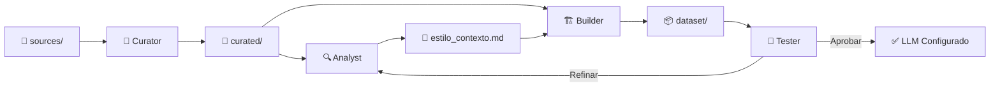

# 🤖 Agentes — VoxMea

> Definición de los agentes de IA y sus roles dentro del pipeline de clonación de estilo.

---

## Agente 1: Curator (Curador de Textos)

**Rol:** Filtrar, limpiar y seleccionar textos que representen auténticamente el estilo del autor.

**Responsabilidades:**
- Escanear la carpeta `sources/` en busca de archivos válidos (`.md`, `.txt`, `.eml`).
- Eliminar bloques de código, logs, tablas de datos puros y contenido irrelevante al estilo.
- Redactar información sensible (nombres propios, direcciones, datos financieros).
- Clasificar textos por tipo: narrativo, argumentativo, informal, técnico-personal.
- Depositar resultados en `curated/`.

**Criterios de Filtrado:**
| Incluir ✅ | Excluir ❌ |
|---|---|
| Reflexiones personales | Código fuente |
| Artículos de opinión | Logs de sistema |
| Correos con tono personal | Datos tabulares puros |
| Notas con voz propia | Copy-paste de terceros |
| Borradores creativos | Templates sin personalizar |

---

## Agente 2: Analyst (Analista de Estilo)

**Rol:** Examinar el corpus curado para extraer un perfil lingüístico detallado del autor.

**Responsabilidades:**
- Analizar patrones de vocabulario, muletillas y expresiones recurrentes.
- Identificar estructura sintáctica predominante (oraciones largas vs. cortas, uso de subordinadas).
- Mapear tono emocional predominante por categoría de texto.
- Detectar recursos retóricos frecuentes (metáforas, ironía, preguntas retóricas).
- Generar el archivo `estilo_contexto.md` con el perfil de estilo resultante.

**Dimensiones de Análisis:**
```
├── Vocabulario        → Registro, tecnicismos, coloquialismos
├── Sintaxis           → Longitud de oraciones, complejidad, ritmo
├── Tono               → Formal/informal, serio/irónico, directo/sutil
├── Estructura         → Párrafos, transiciones, uso de listas
├── Marcadores         → Muletillas, conectores favoritos, puntuación
└── Personalidad       → Humor, referencias culturales, analogías
```

---

## Agente 3: Builder (Constructor del Dataset)

**Rol:** Consolidar y formatear los textos curados en un dataset optimizado para el LLM.

**Responsabilidades:**
- Unificar los textos curados en `corpus_unificado.txt`.
- Generar pares de prompt/completion en formato JSONL para fine-tuning (opcional).
- Segmentar textos largos en chunks apropiados para ventana de contexto.
- Agregar metadatos de contexto (tipo de texto, fecha, tema).
- Validar integridad del dataset final.

**Formato de Salida JSONL (Opcional):**
```json
{
  "messages": [
    {"role": "system", "content": "[System prompt con perfil de estilo]"},
    {"role": "user", "content": "Escribe un párrafo sobre [tema]"},
    {"role": "assistant", "content": "[Texto original del autor sobre ese tema]"}
  ]
}
```

---

## Agente 4: Tester (Evaluador de Calidad)

**Rol:** Validar que las generaciones del LLM repliquen fielmente el estilo del autor.

**Responsabilidades:**
- Ejecutar prompts de prueba contra el LLM configurado.
- Comparar generaciones contra el texto de control seleccionado.
- Evaluar fidelidad en las dimensiones: vocabulario, tono, estructura, personalidad.
- Generar reportes de calidad con métricas de similitud.
- Proponer ajustes al system prompt o al dataset según resultados.

**Métricas de Evaluación:**
| Métrica | Descripción |
|---|---|
| Similitud Léxica | ¿Usa las mismas palabras y expresiones? |
| Coherencia Tonal | ¿Mantiene el mismo tono y registro? |
| Estructura Narrativa | ¿Sigue el mismo patrón de organización? |
| Autenticidad Percibida | ¿Suena genuinamente como el autor? |
| Creatividad Preservada | ¿Mantiene la chispa original sin ser genérico? |

---

## Flujo de Trabajo entre Agentes



---

## Notas

- Los agentes pueden ejecutarse como scripts independientes o como prompts especializados dentro del LLM.
- El flujo es iterativo: los resultados del Tester alimentan refinamientos en el Analyst y Builder.
- Cada agente mantiene logs en `docs/` para trazabilidad.
