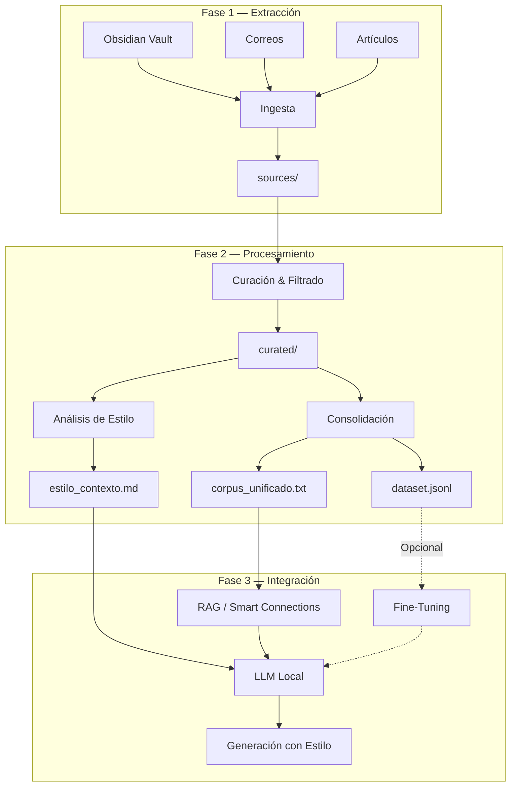
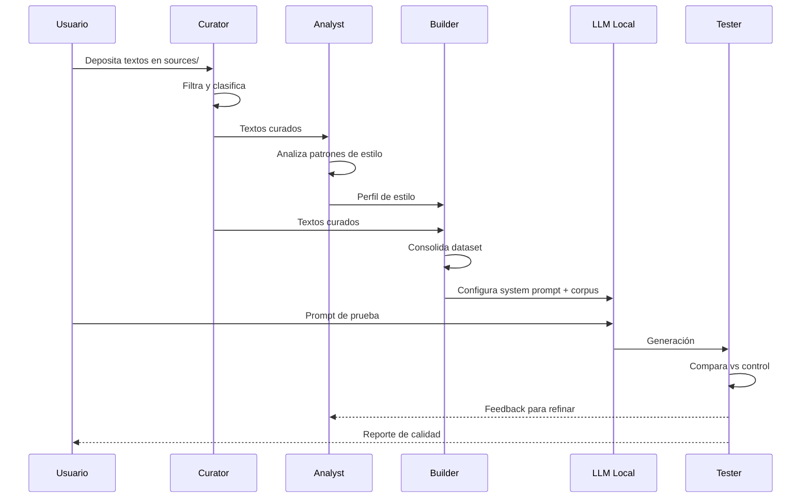

# 🏗️ Arquitectura — VoxMea

> Diseño técnico del pipeline de clonación de estilo de escritura.

---

## Visión General

VoxMea opera como un pipeline de datos en 3 etapas que transforma texto crudo personal en un perfil de estilo consumible por un LLM local.



---

## Estructura de Directorios

```
VoxMea/
│
├── sources/                    # 📥 ENTRADA: Textos sin procesar
│   ├── obsidian/               #    Notas exportadas de Obsidian
│   ├── emails/                 #    Correos exportados (.eml, .txt)
│   └── articles/               #    Artículos y posts
│
├── curated/                    # ✅ Textos filtrados y listos
│   ├── narrativo/              #    Textos narrativos/reflexivos
│   ├── argumentativo/          #    Artículos de opinión
│   ├── informal/               #    Comunicación casual
│   └── tecnico/                #    Escritura técnica con voz propia
│
├── dataset/                    # 📦 SALIDA: Dataset para el LLM
│   ├── estilo_contexto.md      #    System prompt con perfil de estilo
│   ├── corpus_unificado.txt    #    Todos los textos en un solo archivo
│   └── dataset.jsonl           #    (Opcional) Pares para fine-tuning
│
├── scripts/                    # ⚙️ Scripts de procesamiento
│   ├── curate.py               #    Filtrado y limpieza de textos
│   ├── analyze_style.py        #    Análisis lingüístico
│   ├── build_dataset.py        #    Construcción del dataset
│   └── test_generation.py      #    Pruebas de generación
│
├── prompts/                    # 💬 Prompts y plantillas
│   ├── system_prompt.md        #    Prompt de sistema base
│   └── test_prompts.md         #    Prompts de prueba
│
├── tests/                      # 🧪 Textos de control y resultados
│   ├── control_text.md         #    Texto de referencia
│   └── results/                #    Resultados de pruebas
│
└── docs/                       # 📚 Documentación y logs
    ├── style_profile.md        #    Perfil de estilo detallado
    └── logs/                   #    Logs de ejecución
```

---

## Componentes Técnicos

### 1. Motor de Ingesta (`scripts/curate.py`)

**Entrada:** Archivos de `sources/`  
**Salida:** Archivos limpios en `curated/`

```
Funcionalidades:
├── Lectura de formatos: .md, .txt, .eml, .html
├── Extracción de texto plano (strip de YAML frontmatter, HTML tags)
├── Detección y remoción de bloques de código
├── Redacción de datos sensibles (regex patterns)
├── Clasificación por tipo de texto
└── Reporte de estadísticas (palabras, archivos procesados)
```

**Dependencias:** `pathlib`, `re`, `yaml`, `beautifulsoup4`

---

### 2. Analizador de Estilo (`scripts/analyze_style.py`)

**Entrada:** Corpus curado  
**Salida:** `estilo_contexto.md`

```
Análisis:
├── Frecuencia de vocabulario (top N palabras, n-gramas)
├── Longitud promedio de oraciones y párrafos
├── Ratio de puntuación (uso de —, ..., !, ?)
├── Detección de muletillas y conectores recurrentes
├── Clasificación de tono por segmento
└── Perfil consolidado en lenguaje natural
```

**Dependencias:** `collections`, `re`, `statistics`  
**Opcional:** `spacy` (para análisis lingüístico profundo)

---

### 3. Constructor de Dataset (`scripts/build_dataset.py`)

**Entrada:** Textos curados + perfil de estilo  
**Salida:** `corpus_unificado.txt`, `dataset.jsonl`

```
Procesamiento:
├── Concatenación con separadores de documento
├── Chunking inteligente (respetando límites de párrafo)
├── Generación de pares prompt/completion (JSONL)
├── Validación de tokens (dentro de ventana de contexto)
└── Metadatos por segmento (tipo, fecha, tema)
```

**Dependencias:** `json`, `pathlib`, `tiktoken` (opcional para conteo de tokens)

---

### 4. Motor de Pruebas (`scripts/test_generation.py`)

**Entrada:** Prompts de prueba + LLM configurado  
**Salida:** Resultados comparativos

```
Evaluación:
├── Llamada a API local (Ollama REST / LM Studio)
├── Generación con N prompts de prueba
├── Comparación automática vs texto de control
├── Reporte de métricas de similitud
└── Log de resultados en tests/results/
```

**Dependencias:** `requests`, `difflib`

---

## Integración con LLM Local

### Opción A: Prompt de Contexto (Recomendado para inicio)

```
┌─────────────────────────────────────┐
│         System Prompt               │
│  ┌───────────────────────────────┐  │
│  │   estilo_contexto.md          │  │
│  │   (Perfil de estilo)          │  │
│  └───────────────────────────────┘  │
│  ┌───────────────────────────────┐  │
│  │   Fragmentos del corpus       │  │
│  │   (Ejemplos representativos)  │  │
│  └───────────────────────────────┘  │
├─────────────────────────────────────┤
│         User Prompt                 │
│  "Escribe sobre [tema]..."          │
└─────────────────────────────────────┘
```

### Opción B: RAG (Retrieval-Augmented Generation)

```
User Query → Embedding → Vector Search → Fragmentos relevantes → LLM → Respuesta con estilo
                              ↕
                    corpus indexado
                  (Smart Connections)
```

### Opción C: Fine-Tuning (Avanzado)

```
dataset.jsonl → Fine-Tuning (LoRA/QLoRA) → Modelo personalizado → Generación nativa
```

---

## Flujo de Datos



---

## Configuración del Entorno

### Variables de Entorno (`.env`)
```env
# LLM Backend
LLM_BACKEND=ollama          # ollama | lmstudio
OLLAMA_HOST=http://localhost:11434
LMSTUDIO_HOST=http://localhost:1234

# Modelo
MODEL_NAME=llama3.2          # Modelo base a utilizar
MAX_CONTEXT_TOKENS=8192      # Ventana de contexto máxima

# Procesamiento
CHUNK_SIZE=2000              # Tokens por chunk
CHUNK_OVERLAP=200            # Overlap entre chunks
```

### Requisitos Python
```
beautifulsoup4>=4.12
pyyaml>=6.0
requests>=2.31
tiktoken>=0.5      # Opcional: conteo de tokens
spacy>=3.7         # Opcional: NLP avanzado
```

---

## Decisiones de Diseño

| Decisión | Elección | Justificación |
|---|---|---|
| LLM Backend | Ollama (primario) | Más ligero, API REST simple, soporte de modelos abiertos |
| Método inicial | Prompt de contexto | Más rápido de iterar que fine-tuning |
| Formato corpus | TXT plano | Compatible universal, sin overhead de parsing |
| Fine-tuning format | JSONL | Estándar de la industria para training data |
| Análisis de estilo | Regex + estadísticas | Sin dependencias pesadas; spaCy como upgrade opcional |

---

*Última actualización: Mayo 2026*
