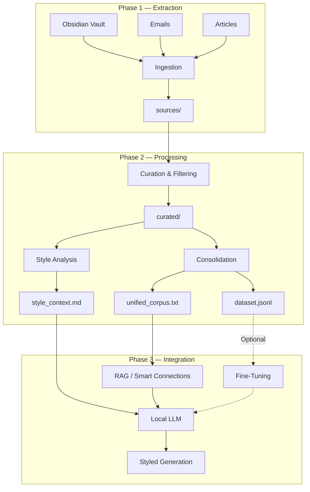
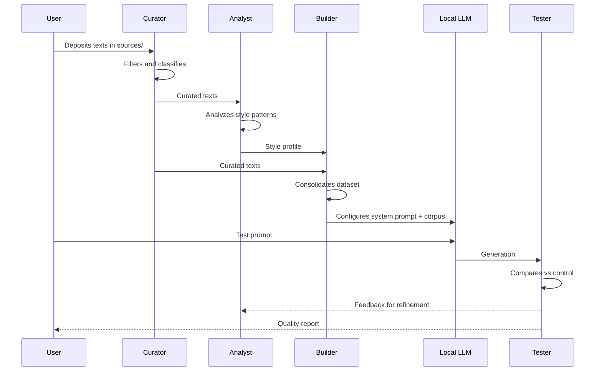

# 🏗️ Architecture — VoxMea

> Technical design of the writing style cloning pipeline.

---

## Overview

VoxMea operates as a 3-stage data pipeline that transforms raw personal text into a style profile consumable by a local LLM.



---

## Directory Structure

```
VoxMea/
│
├── sources/                    # 📥 INPUT: Raw unprocessed texts
│   ├── obsidian/               #    Exported Obsidian notes
│   ├── emails/                 #    Exported emails (.eml, .txt)
│   └── articles/               #    Articles and posts
│
├── curated/                    # ✅ Filtered and ready texts
│   ├── narrative/              #    Narrative/reflective texts
│   ├── argumentative/          #    Opinion articles
│   ├── informal/               #    Casual communication
│   └── technical/              #    Technical writing with personal voice
│
├── dataset/                    # 📦 OUTPUT: Dataset for the LLM
│   ├── style_context.md        #    System prompt with style profile
│   ├── unified_corpus.txt      #    All texts in a single file
│   └── dataset.jsonl           #    (Optional) Pairs for fine-tuning
│
├── scripts/                    # ⚙️ Processing scripts
│   ├── curate.py               #    Text filtering and cleaning
│   ├── analyze_style.py        #    Linguistic analysis
│   ├── build_dataset.py        #    Dataset construction
│   └── test_generation.py      #    Generation testing
│
├── prompts/                    # 💬 Prompts and templates
│   ├── system_prompt.md        #    Base system prompt
│   └── test_prompts.md         #    Test prompts
│
├── tests/                      # 🧪 Control texts and results
│   ├── control_text.md         #    Reference text
│   └── results/                #    Test results
│
└── docs/                       # 📚 Documentation and logs
    ├── style_profile.md        #    Detailed style profile
    └── logs/                   #    Execution logs
```

---

## Technical Components

### 1. Ingestion Engine (`scripts/curate.py`)

**Input:** Files from `sources/`  
**Output:** Clean files in `curated/`

```
Features:
├── Format reading: .md, .txt, .eml, .html
├── Plain text extraction (strip YAML frontmatter, HTML tags)
├── Code block detection and removal
├── Sensitive data redaction (regex patterns)
├── Text type classification
└── Statistics report (word counts, files processed)
```

**Dependencies:** `pathlib`, `re`, `yaml`, `beautifulsoup4`

---

### 2. Style Analyzer (`scripts/analyze_style.py`)

**Input:** Curated corpus  
**Output:** `style_context.md`

```
Analysis:
├── Vocabulary frequency (top N words, n-grams)
├── Average sentence and paragraph length
├── Punctuation ratio (use of —, ..., !, ?)
├── Filler word and recurring connector detection
├── Tone classification per segment
└── Consolidated profile in natural language
```

**Dependencies:** `collections`, `re`, `statistics`  
**Optional:** `spacy` (for deep linguistic analysis)

---

### 3. Dataset Builder (`scripts/build_dataset.py`)

**Input:** Curated texts + style profile  
**Output:** `unified_corpus.txt`, `dataset.jsonl`

```
Processing:
├── Concatenation with document separators
├── Smart chunking (respecting paragraph boundaries)
├── Prompt/completion pair generation (JSONL)
├── Token validation (within context window)
└── Metadata per segment (type, date, topic)
```

**Dependencies:** `json`, `pathlib`, `tiktoken` (optional for token counting)

---

### 4. Testing Engine (`scripts/test_generation.py`)

**Input:** Test prompts + configured LLM  
**Output:** Comparative results

```
Evaluation:
├── Local API calls (Ollama REST / LM Studio)
├── Generation with N test prompts
├── Automated comparison vs control text
├── Similarity metrics report
└── Result logging in tests/results/
```

**Dependencies:** `requests`, `difflib`

---

## Local LLM Integration

### Option A: Context Prompting (Recommended to start)

```
┌─────────────────────────────────────┐
│         System Prompt               │
│  ┌───────────────────────────────┐  │
│  │   style_context.md            │  │
│  │   (Style profile)             │  │
│  └───────────────────────────────┘  │
│  ┌───────────────────────────────┐  │
│  │   Corpus fragments            │  │
│  │   (Representative examples)   │  │
│  └───────────────────────────────┘  │
├─────────────────────────────────────┤
│         User Prompt                 │
│  "Write about [topic]..."           │
└─────────────────────────────────────┘
```

### Option B: RAG (Retrieval-Augmented Generation)

```
User Query → Embedding → Vector Search → Relevant fragments → LLM → Styled response
                              ↕
                    Indexed corpus
                  (Smart Connections)
```

### Option C: Fine-Tuning (Advanced)

```
dataset.jsonl → Fine-Tuning (LoRA/QLoRA) → Custom model → Native generation
```

---

## Data Flow



---

## Environment Configuration

### Environment Variables (`.env`)
```env
# LLM Backend
LLM_BACKEND=ollama          # ollama | lmstudio
OLLAMA_HOST=http://localhost:11434
LMSTUDIO_HOST=http://localhost:1234

# Model
MODEL_NAME=llama3.2          # Base model to use
MAX_CONTEXT_TOKENS=8192      # Maximum context window

# Processing
CHUNK_SIZE=2000              # Tokens per chunk
CHUNK_OVERLAP=200            # Overlap between chunks
```

### Python Requirements
```
beautifulsoup4>=4.12
pyyaml>=6.0
requests>=2.31
tiktoken>=0.5      # Optional: token counting
spacy>=3.7         # Optional: advanced NLP
```

---

## Design Decisions

| Decision | Choice | Justification |
|---|---|---|
| LLM Backend | Ollama (primary) | Lightweight, simple REST API, open model support |
| Initial method | Context prompting | Faster to iterate than fine-tuning |
| Corpus format | Plain TXT | Universal compatibility, no parsing overhead |
| Fine-tuning format | JSONL | Industry standard for training data |
| Style analysis | Regex + statistics | No heavy dependencies; spaCy as optional upgrade |

---

*Last updated: May 2026*
